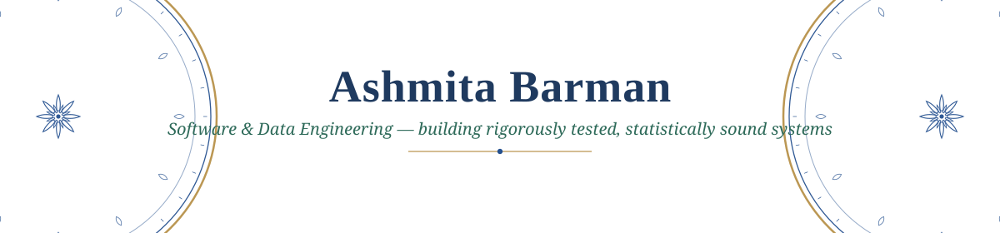

  

  

  
  
  

### ◆ About me

- Currently pursuing an **MSc in Data and Computational Science** at University College Dublin
- A year and a half as a **Software Engineer (SDET)** at Netradyne, Bengaluru, before that — test automation, CI/CD, cloud infrastructure, and leading a 3-person intern team
- Building **[Bealach](https://bealach-dublin.vercel.app)** — a real-time anomaly-detection system for Dublin's public bus network
- Drawn to statistical modeling, time-series anomaly detection, and applied ML on real infrastructure data
- Based in Dublin, Ireland · open to Software/Data Engineering internships

### ◆ Featured project — Bealach

> Real-time anomaly detection for Dublin's public transit, tracking 160 Dublin Bus
> and Go-Ahead Dublin routes live. Cuts false alerts by **200x** versus naive
> anomaly detection, without missing the delays that actually matter.

**[Live](https://bealach-dublin.vercel.app)** · **[Code](https://github.com/ashmitabarman17-dev/bealach)**

  
  
  
  
  
  
  

### ◆ Tech stack

**Languages**

  
  
  
  
  

**Data & ML**

  
  
  
  
  

**Backend & Frontend**

  
  
  
  
  

**Cloud, DevOps & Testing**

  
  
  
  
  

### ◆ GitHub stats

  
  

<i>Dublin, Ireland · always happy to talk transit data, well-tested systems, or the occasional hackathon.</i>

